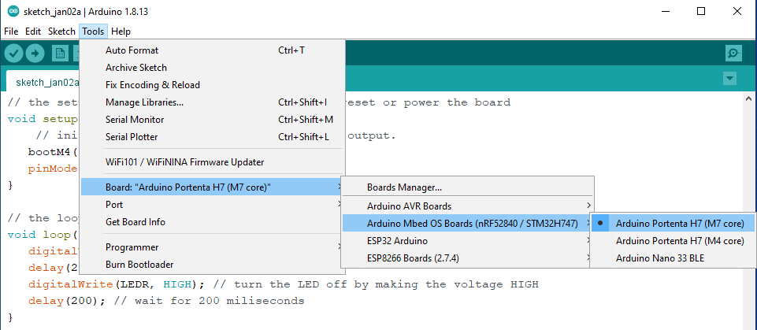
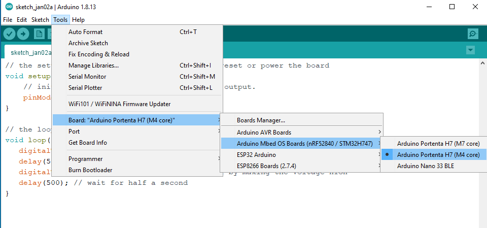

# Dual Core

The Portenta H7 comes with a dual-core [STM32H747 processor](https://www.st.com/en/microcontrollers-microprocessors/stm32h747-757.html), including a Cortex M7 (with double-precision floating-point unit) running up to 480 MHz and a Cortex-M4 core (with single-precision floating-point unit) running with up to 240MHz. Having two cores allows the H7 to run two applications (Arduino sketches in this case) simultaneously.

This README will show you how to use both cores and how to communicate between them using a **Remote Procedure Call** (RPC) mechanism.

## Create separate scripts for both cores

The easiest way to use both of the cores is to create a separate Arduino sketch for each core. The only thing to keep in mind is that only the M7 gets booted automatically. The reason is that for simple use cases the M4 may not be needed and hence be unprogrammed and doesn't need to get powered. As a result, you need to force boot the M4 so it can run a sketch. You can do so by running the `bootM4()` method on the M7.

In the [separate-script directory](separate-scripts), you can find two LED blinking examples. First, upload the [blink_RedLed_M7.ino sketch](separate-scripts/blink_RedLed_M7.ino) to the M7 core by selecting the **Arduino Portenta H7 (M7 core) board**.



Next, upload the [blink_GreenLed_M4.ino sketch](separate-scripts/blink_GreenLed_M4.ino) to the M4 core.



After uploading, the LED should blink both green and red.

## Control both cores with a single script

The cores can also be programmed with a single sketch using the `#ifdef` directives. If you want to, for example, want to control the blue LED with the M7 and the green LED with the M4, you could use a code that looks as follows:

```c++
int myLED;

void setup() {

   randomSeed(analogRead(0));

   #ifdef CORE_CM7
      bootM4();
      myLED = LEDB; // built-in blue LED
   #endif

   #ifdef CORE_CM4
      myLED = LEDG; // built-in greeen LED
   #endif
   pinMode(myLED, OUTPUT);
}

void loop() {
   digitalWrite(myLED, LOW); // turn the LED on
   delay(200);
   digitalWrite(myLED, HIGH); // turn the LED off
   delay( rand() % 2000 + 1000); // wait for a random amount of time between 1 and 3 seconds.
}
```

If you want to split the code of the M7 and M4 in a clearer way, you could also to something like:

```c++
// M7
#ifdef CORE_CM7
  void setup() {
      // initialize digital pin LED_BUILTIN as an output.
     bootM4();
     pinMode(LEDR, OUTPUT);
  }

  // the loop function runs over and over again forever
  void loop() {
     digitalWrite(LEDR, LOW); // turn the LED on (LOW is the voltage level)
     delay(200); // wait for 200 miliseconds
     digitalWrite(LEDR, HIGH); // turn the LED off by making the voltage HIGH
     delay(200); // wait for 200 miliseconds
  }
#endif


// M4
#ifdef CORE_CM4
  void setup() {
      // initialize digital pin LED_BUILTIN as an output.
      pinMode(LEDG, OUTPUT);
  }

  // the loop function runs over and over again forever
  void loop() {
     digitalWrite(LEDG, LOW); // turn the LED on (LOW is the voltage level)
     delay(500); // wait for half a second
     digitalWrite(LEDG, HIGH); // turn the LED off by making the voltage HIGH
     delay(500); // wait for half a second
  }
#endif
```

## Communicating between cores

The two cores can communicate via a Remote Procedure Call (RPC). RPC is a protocol that can be used to request a service from a program that is located on another device, or in this case, on another core.

Using RPC, we can share variables between the two cores, call methods on the other core, or for example allow the M4 core to use the Serial console as shown in the [m4_access_serial_console.ino sketch](communicating-between-cores/m4_access_serial_console.ino).

```c++
// based on: https://github.com/hpssjellis/my-examples-for-the-arduino-portentaH7

#ifdef CORE_CM7
  #include "RPC_internal.h"
  
  void setup() {
     bootM4(); 
     Serial.begin(115200);
     RPC1.begin();
  }
  
  void loop() {
     Serial.println("M7: Hello");
     while (RPC1.available()) {
        Serial.write(RPC1.read()); 
     }  
     delay(3000);
  }
#endif              


#ifdef CORE_CM4    
  #include "RPC_internal.h"
 
  #define Serial RPC1  // Create alias
  
  void setup() {
     Serial.begin();   // RPC.begin does not take a baud rate
  }
  
  void loop() {
    Serial.println("M4: Hello"); 
    delay(3000);
  }
#endif            
```

For more advanced RPC examples, I recommend checking out the [my-examples-for-the-arduino-portentaH7 repository](https://github.com/hpssjellis/my-examples-for-the-arduino-portentaH7).

## Resources

- [Dual Core Processing](https://www.arduino.cc/pro/tutorials/portenta-h7/por-ard-dcp)
- [Arduino Portenta H7 Part 2: Dual-Core Computing](https://unboxing-tomorrow.com/arduino-portenta-h7-part-2-dual-core-computing/)
- [Introduction to RPC](https://os.mbed.com/users/nambvarun/notebook/rpc-tutorial/)
- [my-examples-for-the-arduino-portentaH7](https://github.com/hpssjellis/my-examples-for-the-arduino-portentaH7)
