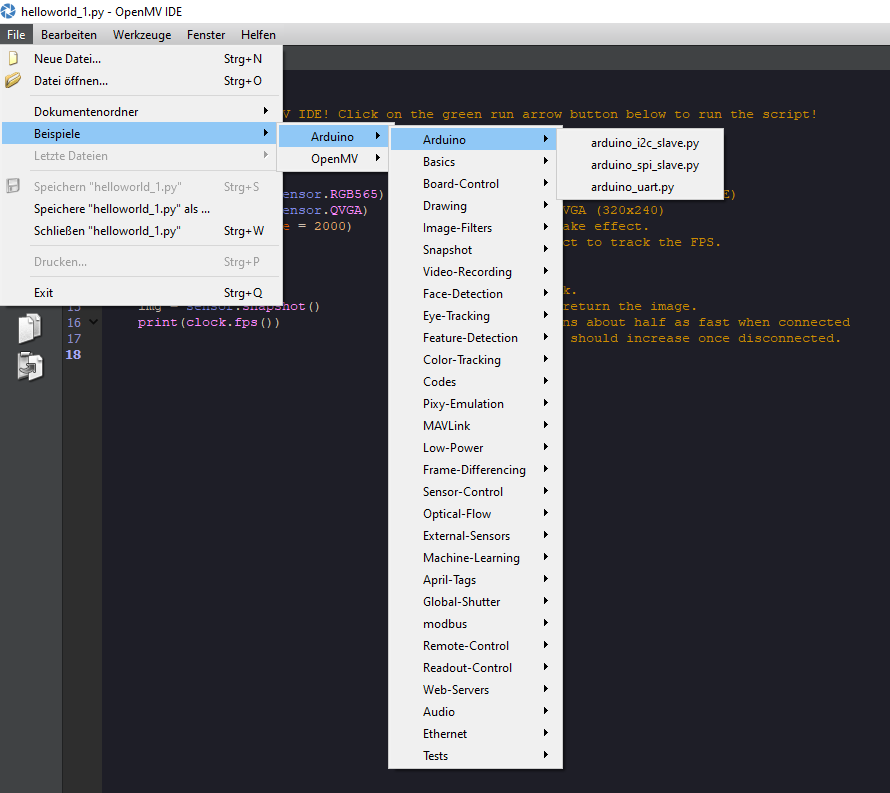

# ARDUINO PORTENTA VISION SHIELD

The Arduino Portenta Vision shield is an addon-board for the Portenta H7 and comes with:
* [Himax HM-01B0 camera module](https://www.himax.com.tw/products/cmos-image-sensor/image-sensors/hm01b0/) with 320 x 320 active pixel resolution
* a 100 Mbps Ethernet connector
* two on-board [MP34DT05 microphones](https://content.arduino.cc/assets/Nano_BLE_Sense_mp34dt05-a.pdf)
* JTAG connector to perform low-level debugging
* SD-Card connector

## Getting started

When getting started with the Portenta vision shield, I recommend first going through the ["Blob Detection with Portenta and OpenMV" article](https://www.arduino.cc/pro/tutorials/portenta-h7/por-openmv-bt) and then playing around with all the examples available inside the OpenMV IDE.

## Resources

* [ARDUINO PORTENTA VISION SHIELD](https://store.arduino.cc/portenta-vision-shield)
* [Blob Detection with Portenta and OpenMV](https://www.arduino.cc/pro/tutorials/portenta-h7/por-openmv-bt)
* [Creating a Basic Face Filter With OpenMV](https://www.arduino.cc/pro/tutorials/portenta-h7/por-openmv-fd)